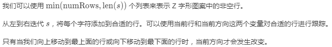
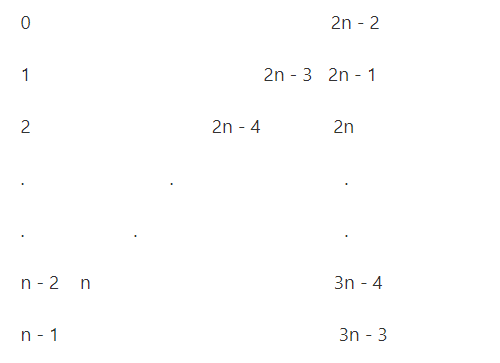
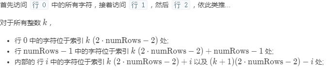

## Z字形变换

#### 题目：

将一个给定字符串根据给定的行数，以从上往下、从左到右进行 Z 字形排列。

比如输入字符串为 `"LEETCODEISHIRING"` 行数为 3 时，排列如下：

```
L   C   I   R
E T O E S I I G
E   D   H   N
```

之后，你的输出需要从左往右逐行读取，产生出一个新的字符串，比如：`"LCIRETOESIIGEDHN"`。

请你实现这个将字符串进行指定行数变换的函数：

```
string convert(string s, int numRows);
```

**示例 1:**

```
输入: s = "LEETCODEISHIRING", numRows = 3
输出: "LCIRETOESIIGEDHN"
```

**示例 2:**

```
输入: s = "LEETCODEISHIRING", numRows = 4
输出: "LDREOEIIECIHNTSG"
解释:

L     D     R
E   O E   I I
E C   I H   N
T     S     G
```

#### 初始思路：

1. 看到这个 “Z” 字，想到了，把该字符串转换为二维数组，不是 Z 的坐标的，填入一个特殊字符
2. 然后读取输出的时候，横向读取，去除特殊字符即可。

#### 问题：

1. 创建的二维数组大小不容易确定
2. 会有大部分闲置的无效字符，浪费资源
3. 由于行数不确定，所以，无效字符的位置无法被确定。

## 官方题解

- [详情参见](https://leetcode-cn.com/problems/zigzag-conversion/solution/z-zi-xing-bian-huan-by-leetcode/) 

### 方法一：按行排序

#### 思路

通过从左向右迭代字符串，我们可以轻松地确定字符位于 Z 字形图案中的哪一行。

#### 算法

 

#### 代码

```java
class Solution {
    public String convert(String s, int numRows) {

        if (numRows == 1) return s;

        List<StringBuilder> rows = new ArrayList<>();
        for (int i = 0; i < Math.min(numRows, s.length()); i++)
            rows.add(new StringBuilder());

        int curRow = 0;
        boolean goingDown = false;

        for (char c : s.toCharArray()) {
            rows.get(curRow).append(c);
            if (curRow == 0 || curRow == numRows - 1) goingDown = !goingDown;
            curRow += goingDown ? 1 : -1;
        }

        StringBuilder ret = new StringBuilder();
        for (StringBuilder row : rows) ret.append(row);
        return ret.toString();
    }
}
```

#### 复杂度分析

- 时间复杂度：O(n)，其中 n == \text{len}(s)n==len(s)
- 空间复杂度：O(n)

### 方法二：按行访问

#### 规律

 

#### 思路

按照与逐行读取 Z 字形图案相同的顺序访问字符串。

#### 算法

 

#### 代码

```java
class Solution {
    public String convert(String s, int numRows) {

        if (numRows == 1) return s;

        StringBuilder ret = new StringBuilder();
        int n = s.length();
        int cycleLen = 2 * numRows - 2;

        for (int i = 0; i < numRows; i++) {
            for (int j = 0; j + i < n; j += cycleLen) {
                ret.append(s.charAt(j + i));
                if (i != 0 && i != numRows - 1 && j + cycleLen - i < n)
                    ret.append(s.charAt(j + cycleLen - i));
            }
        }
        return ret.toString();
    }
}
```

#### 复杂度分析

- 时间复杂度：O(n)，其中 n == \text{len}(s)n==len(s)。每个索引被访问一次。
- 空间复杂度：O(n)。

## 总结

1. 注意那个按行排序的思想，把问题简单化，不要一直看着 “Z” 字，其实可以转化为正常的矩形
2. 按行访问的那个思路，关键在于总结出那个 “Z” 形字的规律
